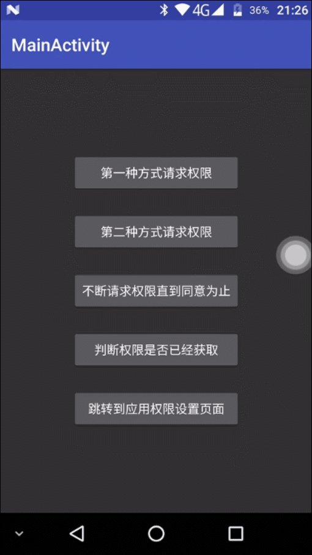

# 权限请求框架

> 有两种不同的方式请求权限，推荐使用第一种方式

> 支持以下类中进行的请求权限操作

* android.app.Activity

* android.app.Fragment

* android.support.v4.app.Fragment

> 编译时需要使用 targetSdkVersion >= 23 的Android版本进行编译，框架经过半年的不间断维护已经很完美，将近百次修改，做足了各种测试，对内存也进行了优化，完全能胜任各种开发需求，使用起来简单方便，[点击下载演示Demo](https://raw.githubusercontent.com/getActivity/EasyPermissions/master/EasyPermissionsDemo.apk)

#### 集成步骤

> 在Module工程的build.gradle文件中添加依赖

    dependencies {
        compile 'com.hjq:easypermissions:6.0'
    }

> 如果导入失败，请检查在Project工程的build.gradle文件的配置

    allprojects {

        repositories {
            //添加对JCenter仓库的支持
            jcenter()
            ......
        }
        ......
    }

> 需要注意的是危险权限也需要在AndroidManifest.xml清单文件中注册，否则将无法正常申请权限

> 如果请求的权限组部分没有被授予，会同时调用成功和失败的方法，具体可通过方法的List参数获取到被授予或被拒绝授予的权限组

#### 第一种方式（回调接口）

> 在Activity或Fragment下请求权限示例，可直接复制粘贴

    //请求的权限组
    private static final String[] requestPermission = {Permission.READ_EXTERNAL_STORAGE, Permission.WRITE_EXTERNAL_STORAGE};

    //动态申请文件读写权限
    public void requestFilePermissions() {

        EasyPermissions.request(this, new OnRequestCallBack() {
            
            @Override
            public void hasPermission(List<PermissionInfo> granted) {
                Toast.makeText(mContext, "获取SD卡读取写入权限成功", Toast.LENGTH_SHORT).show();
            }

            @Override
            public void noPermission(List<PermissionInfo> denied, boolean quick) {
                if(quick) {
                    Toast.makeText(mContext, "被永久拒绝授权，请手动授予权限", Toast.LENGTH_SHORT).show();
                    //如果是被永久拒绝就跳转到应用权限系统设置页面
                    PermissionUtils.gotoPermissionSettings(mContext);
                }else {
                    Toast.makeText(mContext, "获取SD卡读取写入权限失败", Toast.LENGTH_SHORT).show();
                }
            }

        }, requestPermission);
    }

    //必须覆盖Activity或Fragment中的方法，可将此方法封装到BaseActivity或者BaseFragment中
    @Override
    public void onRequestPermissionsResult(int requestCode, String[] permissions, int[] grantResults) {
        super.onRequestPermissionsResult(requestCode, permissions, grantResults);
        //回调权限请求框架，多个权限请求只需要调用一次
        EasyPermissions.onRequestPermissionsResult(requestCode, permissions, grantResults);
    }

#### 第二种方式（注解方法）

> 在Activity或Fragment下请求权限示例，可直接复制粘贴

    //请求的权限组
    private static final String[] requestPermission = {Permission.READ_EXTERNAL_STORAGE, Permission.WRITE_EXTERNAL_STORAGE};

    //动态申请文件读写权限
    public void requestFilePermissions() {

        SimplePermissions.request(this, requestPermission);
    }

    //必须覆盖Activity或Fragment中的方法，可将此方法封装到BaseActivity或者BaseFragment中
    @Override
    public void onRequestPermissionsResult(int requestCode, String[] permissions, int[] grantResults) {
        super.onRequestPermissionsResult(requestCode, permissions, grantResults);
        //回调权限请求框架，多个权限请求只需要调用一次
        SimplePermissions.onRequestPermissionsResult(requestCode, permissions, grantResults);
    }

    @HasPermission
    public void openFileSucceed() {
        Toast.makeText(mContext, "获取SD卡读取写入权限成功", Toast.LENGTH_SHORT).show();
    }

    @NoPermission
    public void openFileFail() {
        Toast.makeText(mContext, "获取SD卡读取写入权限失败", Toast.LENGTH_SHORT).show();
    }

    //如果需要参数可以使用这两个方法，不能和上面的两个无参方法一起使用
    //@HasPermission
    //public void openFileSucceed(List<PermissionInfo> granted) {
    //    Toast.makeText(mContext, "获取SD卡读取写入权限成功，有" + granted.length + "个权限请求成功", Toast.LENGTH_SHORT).show();
    //}
    //
    //@NoPermission
    //public void openFileFail(List<PermissionInfo> denied, boolean quick) {
    //    Toast.makeText(mContext, "获取SD卡读取写入权限失败，有" + denied.length + "个权限请求失败", Toast.LENGTH_SHORT).show();
    //}

#### 判断权限是否已经获取

    //请求的权限组
    String[] requestPermission = {Permission.READ_EXTERNAL_STORAGE, Permission.WRITE_EXTERNAL_STORAGE};

    if (PermissionUtils.isHasPermission(mContext, requestPermission)) {
        Toast.makeText(mContext, "已经获取到SD卡读写权限，不需要再次申请了", Toast.LENGTH_SHORT).show();
        return;
    }

#### 跳转到应用权限设置页面

    PermissionUtils.gotoPermissionSettings(mContext);

#### Activity权限基类

> 可以让你的Activity或者BaseActivity继承PermissionActivity，这样子类Activity及关联的Fragment可以不用重写onRequestPermissionsResult方法，也无需调用权限处理类中的方法

> 下面是PermissionActivity的源码，仅供参考

    public abstract class PermissionActivity extends AppCompatActivity {

        @Override
        public void onRequestPermissionsResult(int requestCode, String[] permissions, int[] grantResults) {
            super.onRequestPermissionsResult(requestCode, permissions, grantResults);
            EasyPermissions.onRequestPermissionsResult(requestCode, permissions, grantResults);
            SimplePermissions.onRequestPermissionsResult(requestCode, permissions, grantResults);
        }
    }

#### PermissionInfo类

> 一般在接收结果的方法，有定义该List集合，集合存放的类型为PermissionInfo

> 下面是PermissionInfo的源码，此处省略get和set方法，仅供参考

    public class PermissionInfo {
    
        /**
         * 权限名称
         */
        private String name;
    
        /**
         * 是否请求成功
         */
        private boolean granted;
    
        /**
         * 是否被永久拒绝
         */
        private boolean permanent;
    
        /**
         * 是否需要自行向用户解释
         */
        private boolean explain;
    }

#### 安卓8.0权限适配

> 在 Android 8.0 之前，如果应用在运行时请求权限并且被授予该权限，系统会错误地将属于同一权限组并且在清单中注册的其他权限也一起授予应用。

> 对于针对 Android 8.0 的应用，此行为已被纠正。系统只会授予应用明确请求的权限。然而，一旦用户为应用授予某个权限，则所有后续对该权限组中权限的请求都将被自动批准。

> 例如，假设某个应用在其清单中列出 READ_EXTERNAL_STORAGE 和 WRITE_EXTERNAL_STORAGE。应用请求 READ_EXTERNAL_STORAGE，并且用户授予了该权限。如果该应用针对的是 API 级别 24 或更低级别，系统还会同时授予 WRITE_EXTERNAL_STORAGE，因为该权限也属于同一 STORAGE 权限组并且也在清单中注册过。如果该应用针对的是 Android 8.0，则系统此时仅会授予 READ_EXTERNAL_STORAGE；不过，如果该应用后来又请求 WRITE_EXTERNAL_STORAGE，则系统会立即授予该权限，而不会提示用户

> Android 8.0 之前的版本，同一组的任何一个权限被授权了，组内的其他权限也自动被授权，但是Android 8.0之后的版本，需要更明确指定所使用的权限，并且系统只会授予申请的权限，不会授予没有组内的其他权限，这意味着，如果只申请了外部存储空间读取权限，在低版本下（API < 26）对外部存储空间使用写入操作是没有问题的，但是在高版本（API >= 26）下是会出现问题的，解决方案是需要两个将读和写的权限一起申请

    public final class Permission {
    
        /**
         * 日历
         */
        public static final String READ_CALENDAR = "android.permission.READ_CALENDAR";
        public static final String WRITE_CALENDAR = "android.permission.WRITE_CALENDAR";
    
        /**
         * 摄像头
         */
        public static final String CAMERA = "android.permission.CAMERA";
    
        /**
         * 联系人
         */
        public static final String READ_CONTACTS = "android.permission.READ_CONTACTS";
        public static final String WRITE_CONTACTS = "android.permission.WRITE_CONTACTS";
        public static final String GET_ACCOUNTS = "android.permission.GET_ACCOUNTS";
    
        /**
         * 位置
         */
        public static final String ACCESS_FINE_LOCATION = "android.permission.ACCESS_FINE_LOCATION";
        public static final String ACCESS_COARSE_LOCATION = "android.permission.ACCESS_COARSE_LOCATION";
    
        /**
         * 话筒
         */
        public static final String RECORD_AUDIO = "android.permission.RECORD_AUDIO";
    
        /**
         * 电话
         */
        public static final String READ_PHONE_STATE = "android.permission.READ_PHONE_STATE";
        public static final String CALL_PHONE = "android.permission.CALL_PHONE";
        public static final String READ_CALL_LOG = "android.permission.READ_CALL_LOG";
        public static final String WRITE_CALL_LOG = "android.permission.WRITE_CALL_LOG";
        public static final String ADD_VOICEMAIL = "com.android.voicemail.permission.ADD_VOICEMAIL";
        public static final String USE_SIP = "android.permission.USE_SIP";
        public static final String PROCESS_OUTGOING_CALLS = "android.permission.PROCESS_OUTGOING_CALLS";
    
        /**
         * 传感器
         */
        public static final String BODY_SENSORS = "android.permission.BODY_SENSORS";
    
        /**
         * 短信
         */
        public static final String SEND_SMS = "android.permission.SEND_SMS";
        public static final String RECEIVE_SMS = "android.permission.RECEIVE_SMS";
        public static final String READ_SMS = "android.permission.READ_SMS";
        public static final String RECEIVE_WAP_PUSH = "android.permission.RECEIVE_WAP_PUSH";
        public static final String RECEIVE_MMS = "android.permission.RECEIVE_MMS";
    
        /**
         * 存储
         */
        public static final String READ_EXTERNAL_STORAGE = "android.permission.READ_EXTERNAL_STORAGE";
        public static final String WRITE_EXTERNAL_STORAGE = "android.permission.WRITE_EXTERNAL_STORAGE";
    }

#### 混淆配置

>如果使用回调接口的方式请求权限，则不需要任何配置

>如果使用注解方法的方式请求权限，需要在proguard中添加混淆规则

    #EasyPermissions避免混淆
    -keepclassmembers class ** {
        @com.hjq.permissions.HasPermission <methods>;
    }
    -keepclassmembers class ** {
        @com.hjq.permissions.NoPermission <methods>;
    }
